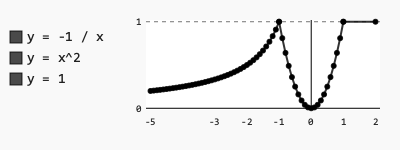
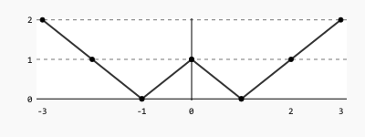

# Розробка програм, що розгалужуються

## Структура директорії для лабораторної роботи

```
.
└── lab04
    ├── Makefile
    ├── README.md
    ├── doc
    │   └── lab04.txt
    └── src
        └── main.c
```

## Індивідуальні завдання.

Виконати одне завдання з пулу завдань на свій розсуд згідно її складності (що впливає на максимальну оцінку, що може бути отримана за лабораторну роботу). **Зверніть увагу**. Викладач має право надати вам додаткове завдання для виконання.

1.	Знайти мінімальне значення серед заданих трьох змінних.
2.	Для заданих речовинних чисел *a*, *b*, *c* визначити корінь квадратного рівняння  $ax^2 + bx + c = 0$, якщо він є і тільки один.
3.	При заданому *x* обчислити значення *у* відповідно до формули:

$$ y =
\begin{cases}
    x^2 - 1, x > 0\\
    5x^2 - x + 3, x \leq 0
\end{cases}
$$

4.	Студенти на іспиті отримують оцінки в системі *ЄКТС* (літери *A*, *B*, *C*, *D*, *E*, *F*). За заданою оцінкою визначити її еквівалент у національній формі (цифровій).
5.	Визначити, чи існує трикутник з заданими кутами *a*, *b*, *c*. 
6.	Знайти максимальне значення серед заданих трьох змінних.
7.	Дано два дійсних числа *x* та *g*. При цьому *g* - натуральне число. Визначити *y*:

$$ y =
\begin{cases} 
    x - g, x > g\\
    12 + (g - x), 0 \leq x \leq g \\
    x^2, x < 0
\end{cases}
$$

8.	Визначити, чи існує ромб з заданими сторонами *a*, *b*, *c*, *d*.
8.	Визначити, чи існує прямокутник з заданими кутами *a*, *b*, *c*, *d*.
10.	Визначити, чи існує трикутник з заданими сторонами *a*, *b*, *c*.
11.	Визначити, чи існує ромб з заданими кутами *a*, *b*, *c*, *d*.
12.	При заданих значеннях *x* та *m*, визначити значення *у* відповідно до формули:

$$ y =
\begin{cases}
    x^2 - m^2, x > m\\
    5x^2 - x + 3m, x \leq m
\end{cases}
$$

13.	Визначити, чи існує ромб з заданими сторонами *a*, *b*, *c*, *d*.
14.	(`*`) Визначити, чи є серед цифр заданого трьох-значного числа однакові цифри.
15.	(`*`) Визначити позицію цифри з мінімальним значенням у трьох-значному числі. Нумерація починається з 1. Наприклад, $x = 413$ -> Мінімальне значення дорівнює *1*, що знаходиться у 2й позиції.
16.	(`*`) Визначити століття за заданим роком. Наприклад, 
	- $x = 2010$ ->  $y = 21$;
	- $x = 2200$ ->  $y = 22$.
17.	(`*`) Дано радіус сфери *r* та значення *k*. Використовуючи конструкцію *switch-case* обчислити значення *у* згідно з умовами: 
	- $k = 1$.  *у* => значення периметри поперечного перерізу;
	- $k = 2$.  *у* => значення площі поперечного перерізу;
	- $k = 3$.  *у* => значення об'єму сфери;
	- інакше. $y = -1$.
18.	(`*`) Визначити, у скільки разів величина цілої частини числа більше за дробову. Організувати перевірку ділення на 0. Результат "обрізати" до другого знака після коми. Наприклад, $x = 123.656$  ->  $y = 123 / 656 = 0.1875 = 0.180000$.
19.	(`*`) При заданих *a*, *b* та *f* визначити значення $c$. Визначити a та b після обчислень. Обґрунтувати результат.
	- *c = a++ + ++b*, якщо *f* дорівнює 1; 
	- *c = a\-\- - \-\-b*, якщо *f* дорівнює 0. 
20.	(`**`) За заданим радіусом *r* та командою (*'l'*, *'s'* або *'v'*) користувача обчислити:
	-	довжину  окружності, якщо команда – *'l'*;
	-	площу кола, якщо команда – *'s'*;
	-	об’єм кулі, якщо команда – *'v'*.
21.	(`**`) Визначити, у скільки разів значення дробової частини числа більше за цілу. Організувати перевірку ділення на 0. Результат "обрізати" до другого знака після коми. Наприклад, $x = 123.656$  ->  $y = 656 / 123 = 5.333333 = 5.330000$.
22.	(`**`) Дано три числа *k*, *m*, *n*. Змінити значення змінних таким чином, щоб виконувалась умова $k <= m <= n$. При тестуванні реалізації завдання перевірте комбінації, коли на початку рівняння таке: $k <= m >= n$, $k >= m >= n$, $k >= n >= m$.
23.	(`**`) Дано дійсне число *x*. Для функції *y(x)*, графік якої подано на рисунку нижче, обчислити значення *y*.



24.	(`**`) Дано дійсне число *x*. Для функції *y(x)*, графік якої поданий на рисунку нижче, обчислити значення *y*.



25.  (`**`) Визначити, чи є ціле 6-значне число "щасливим" квитком ("щасливий квиток" – квиток, в якому сума першої половини чисел номера дорівнює сумі другої половини. Наприклад, білет з номером *102300* є щасливим, бо $1+0+2=3+0+0$.

## Додаткові обов'язкові умови виконання робот

- текст програми повинен мати коментарі до коду. Точка входу має також бути документована формулюванням завдання, а також по-пунктного його виконанням. Поряд з кожною змінною повино бути вказано її призначення; 
- структура проекту повинна бути згідно вимогам;
- звіт має містити інформацію про хід виконання завдання, а саме:
   - створення проекту та файлу з вихідним кодом;
   - визначити, де знаходиться точка входу; описати її знаходження, призначення, та чому вона повинна бути одна;
   - запуск програми; 
   - зупинка посередині виконання програми за допомогою breakpoints. Навести приклад зміни стану програми "на льоту";
- звіт не повинен мати зображення.

## Контрольні питання. 
1.	Як працює умовний оператор *if*?
2.	Який вираз називається складеним логічним? Наведіть приклади.
3.	Який оператор називають оператором множинного вибору? Наведіть приклад.
4.	Як працює оператор *switch*?
5.	Як працює тернарний оператор? Наведіть приклад.
6.	Коли умовний оператор називається вкладеним?
7.	Навіщо в операторі *switch* використовується оператор *break*?
8.	Чи можуть бути вкладеними оператори *switch*?
9.	Чи можна замість оператора *if* використовувати тернарний оператор і навпаки, – замість тернарного – оператор *if*?

